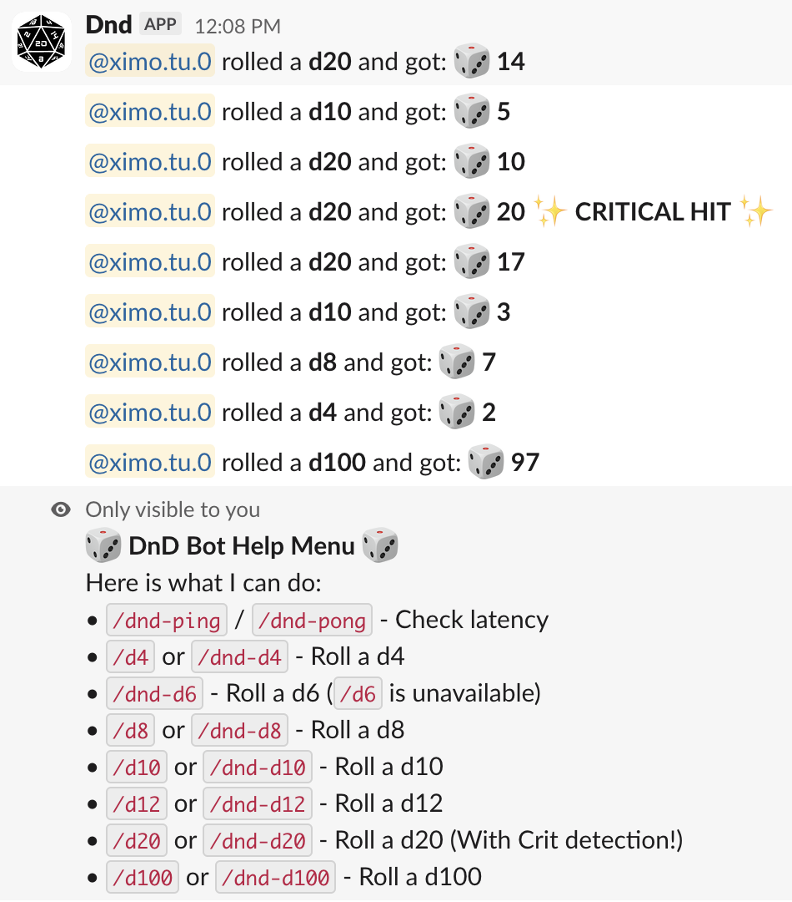

# dnd-slack-bot
A Slack bot that emulates dice rolls such as those in dungeons and dragons (D&D)

With support for non-standard dice sizes including the famous D&D D20 which is a 20 faced die

Try it out in the hack-club slack #dnd-bot-spam:
[https://hackclub.slack.com/archives/C0BA6T4PG03](https://hackclub.slack.com/archives/C0BA6T4PG03)

